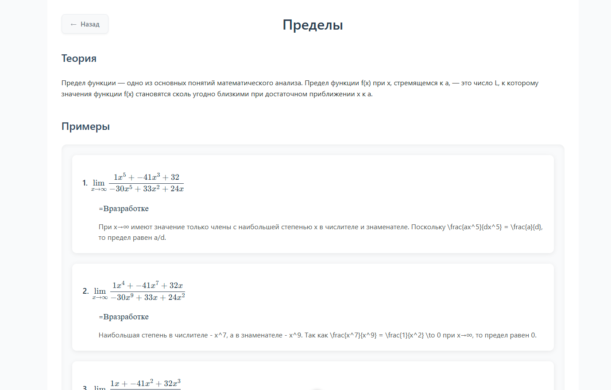

# 🎓 Учебная Платформа

<p align="center">
  
  
  
</p>

<p align="center">
  Интерактивная образовательная платформа для изучения различных дисциплин с динамической генерацией примеров и задач через API.
</p>

## 🌟 Возможности

- **🧮 Различные дисциплины**: математика, физика, химия, биология
- **📊 Уровни сложности**: выбор подходящего уровня для комфортного обучения
- **📱 Адаптивный дизайн**: работает на всех устройствах
- **🎨 Современный интерфейс**: интуитивно понятный и приятный дизайн
- **🔄 Динамическая генерация примеров**: каждый пример уникален благодаря API-интеграции
- **📊 Интерактивные формулы**: визуализация математических выражений с KaTeX
- **📝 Проверка решений**: мгновенная обратная связь по решенным задачам
- **📥 Экспорт в PDF**: возможность скачать примеры для офлайн-изучения

## 🔗 Демо

[Ссылка на живую демонстрацию проекта](https://hackathon-college.netlify.app/)

## 🖼️ Скриншоты

<div align="center">
  
  <p><i>Главная страница с выбором дисциплин</i></p>
  
  
  <p><i>Страница с математическими уравнениями</i></p>

  
  <p><i>Интерактивные примеры пределов с возможностью скачивания PDF</i></p>
</div>

## 🚀 Технологии

- **Фронтенд**:

  - Vue.js 3 (Composition API)
  - Vite для быстрой сборки
  - Vue Router для навигации
  - KaTeX для отображения математических формул
  - html2pdf.js для экспорта контента в PDF
  - Axios для API-запросов

- **Бэкенд**:

  - FastAPI для обработки API-запросов
  - Алгоритмы для генерации математических задач
  - Валидация и проверка решений

- **DevOps**:
  - Netlify для хостинга фронтенда и CI/CD
  - Docker для контейнеризации бэкенда

## 💻 Установка и запуск

```bash
# Клонирование репозитория
git clone https://github.com/ваш-пользователь/название-репозитория.git
cd название-репозитория

# Установка зависимостей
npm install

# Запуск в режиме разработки
npm run dev

# Сборка для продакшена
npm run build
```

### Запуск бэкенда

```bash
# Запуск сервера FastAPI
cd server
pip install -r requirements.txt
uvicorn main:app --reload
```

## 🔧 Особенности реализации

- **Динамическая генерация коэффициентов**:

  - Каждый запрос к API возвращает новые коэффициенты для задач
  - Корректно сформированные ответы, адаптированные к сложности

- **Интерактивные компоненты**:

  - Кастомные UI компоненты (Button, MathFormula)
  - Анимации для улучшения пользовательского опыта

- **Функциональность по дисциплинам**:

  - **Математика**: пределы, интегралы, дифференциальные уравнения
  - **Физика**: законы механики, термодинамика, электромагнетизм
  - **Химия**: химические реакции, органическая химия
  - **Биология**: генетика, анатомия, экология

- **Экспорт и печать**:
  - Конвертация примеров в PDF для сохранения и печати
  - Форматированные документы с сохранением стилей и формул

## 📚 Структура проекта

```
src/
├── assets/         # Изображения и статические ресурсы
├── components/     # Компоненты Vue
│   ├── ui/         # UI компоненты (Button, MathFormula)
│   └── ...
├── pages/          # Основные страницы приложения
│   ├── Home.vue    # Главная страница
│   ├── Limits.vue  # Страница с пределами
│   └── ...
├── router/         # Маршрутизация
└── App.vue         # Корневой компонент

server/             # Бэкенд на FastAPI
├── routes/         # API-маршруты
├── models/         # Модели данных
└── services/       # Сервисные функции
```

## 🔮 Планы на будущее

- Добавление системы авторизации пользователей
- Расширение базы задач и дисциплин
- Интеграция с системами обучения (LMS)
- Персонализированные рекомендации на основе успеваемости
- Мобильное приложение с React Native или Flutter

## 👥 Авторы

- Разработчики команды Хакатона
- При поддержке Колледжа

## 📄 Лицензия

MIT License
