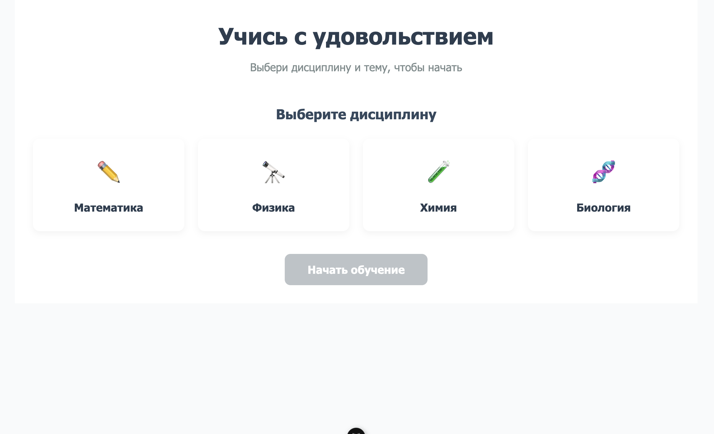
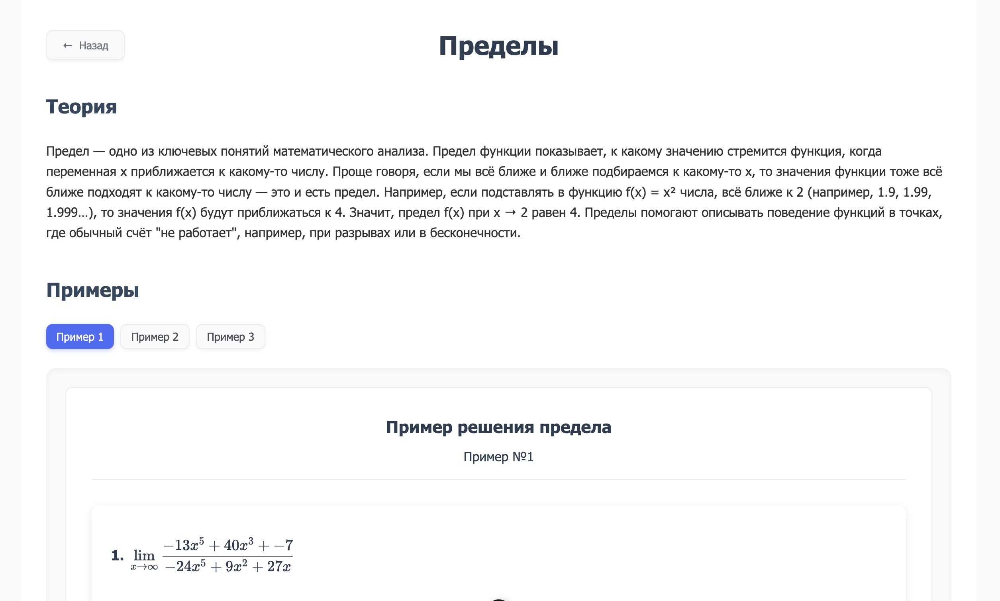
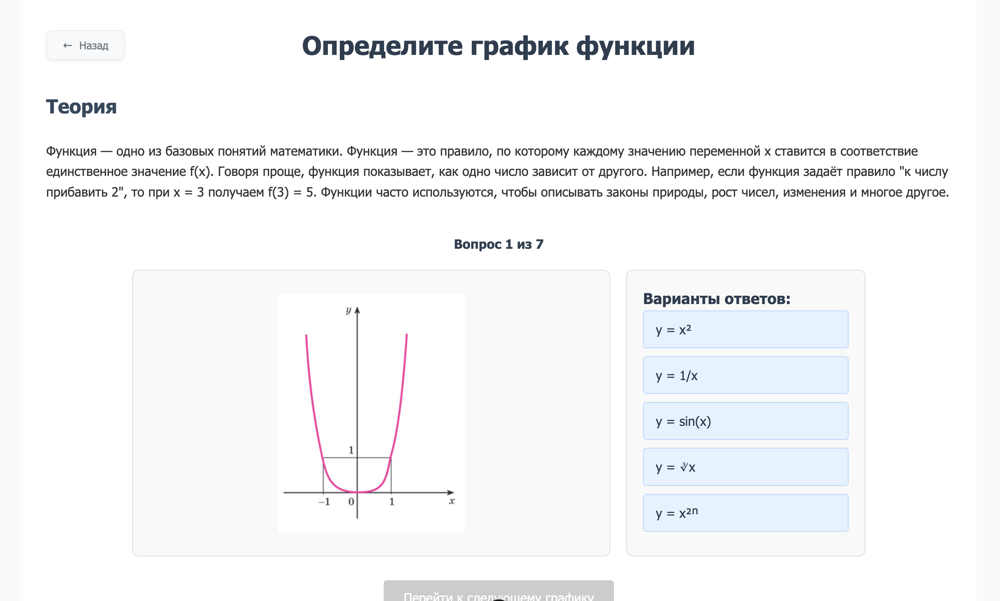
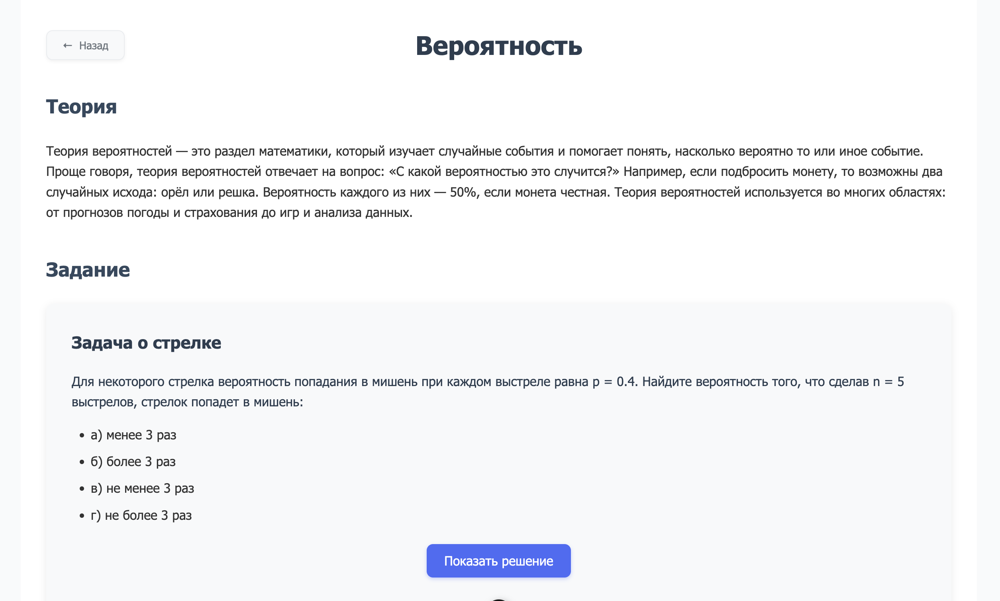

# 🎓 Учебная Платформа

<p align="center">
  
  
  
</p>

<p align="center">
  Интерактивная образовательная платформа для изучения различных дисциплин с динамической генерацией примеров и задач через API.
</p>

## 🌟 Возможности

- **🧮 Различные дисциплины**: математика, физика, химия, биология
- **📊 Уровни сложности**: выбор подходящего уровня для комфортного обучения
- **📱 Адаптивный дизайн**: работает на всех устройствах
- **🎨 Современный интерфейс**: интуитивно понятный и приятный дизайн
- **🔄 Динамическая генерация примеров**: каждый пример уникален благодаря API-интеграции
- **📊 Интерактивные формулы**: визуализация математических выражений с KaTeX
- **📝 Проверка решений**: мгновенная обратная связь по решенным задачам
- **📥 Экспорт в PDF**: возможность скачать примеры для офлайн-изучения

## 🔗 Демо

[Ссылка на живую демонстрацию проекта](https://hackathon-college.netlify.app/)

## 🖼️ Скриншоты

<div align="center">
  
  <p><i>Главная страница с выбором дисциплин</i></p>
  
  
  <p><i>Страница с пределами</i></p>

  
  <p><i>Страница с графиками функций</i></p>

  
  <p><i>Страница с вероятнотстями</i></p>
</div>

## 🚀 Технологии

- **Фронтенд**:

  - Vue.js 3 (Composition API)
  - Vite для быстрой сборки
  - Vue Router для навигации
  - KaTeX для отображения математических формул
  - html2pdf.js для экспорта контента в PDF
  - Axios для API-запросов

- **API-интеграция**:

  - Axios для запросов к внешнему API
  - Обработка и визуализация полученных данных
  - Валидация и проверка решений

- **DevOps**:
  - Netlify для хостинга фронтенда и CI/CD
  - Docker для контейнеризации бэкенда

## 💻 Установка и запуск

```bash
# Клонирование репозитория
git clone https://github.com/ваш-пользователь/название-репозитория.git
cd название-репозитория

# Установка зависимостей
npm install

# Запуск в режиме разработки
npm run dev

# Запуск тестов
npm run test

# Сборка для продакшена
npm run build
```

## 🔧 Особенности реализации

- **Динамическая генерация коэффициентов**:

  - Каждый запрос к API возвращает новые коэффициенты для задач
  - Корректно сформированные ответы, адаптированные к сложности

- **Интерактивные компоненты**:

  - Кастомные UI компоненты (Button, MathFormula)
  - Анимации для улучшения пользовательского опыта

- **Функциональность по дисциплинам**:

  - **Математика**: пределы, интегралы, дифференциальные уравнения
  - **Физика**: законы механики, термодинамика, электромагнетизм
  - **Химия**: химические реакции, органическая химия
  - **Биология**: генетика, анатомия, экология

- **Экспорт и печать**:
  - Конвертация примеров в PDF для сохранения и печати
  - Форматированные документы с сохранением стилей и формул

## 📚 Структура проекта

```
├── src/                      # Исходный код приложения
│   ├── assets/               # Изображения и статические ресурсы
│   ├── components/           # Компоненты Vue
│   │   ├── ui/               # UI компоненты
│   │   │   ├── Button.vue    # Универсальная кнопка
│   │   │   ├── BackButton.vue # Кнопка возврата
│   │   │   ├── TopicButton.vue # Кнопка выбора темы
│   │   │   └── MathFormula.vue # Компонент для отображения математических формул
│   │   └── SubjectCard.vue   # Карточка предмета
│   ├── pages/                # Основные страницы приложения
│   │   ├── Home.vue          # Главная страница
│   │   └── math/             # Страницы математических разделов
│   │       ├── Limits.vue    # Страница с пределами
│   │       ├── Graphics.vue  # Страница с графиками
│   │       └── Probability.vue # Страница с вероятностями
│   ├── router/               # Маршрутизация
│   │   └── index.js          # Конфигурация маршрутов
│   ├── App.vue               # Корневой компонент
│   └── main.js               # Точка входа приложения
│
├── public/                   # Статические файлы
├── screenshots/              # Скриншоты для README
├── index.html                # Основной HTML файл
├── vite.config.js            # Конфигурация Vite
├── vitest.config.js          # Конфигурация тестирования
├── package.json              # Зависимости и скрипты
├── jsconfig.json             # Конфигурация JavaScript
├── netlify.toml              # Конфигурация для деплоя на Netlify
└── .prettierrc.json          # Настройки форматирования кода
```

> **Примечание**: API-запросы для генерации примеров и задач выполняются к внешнему сервису, отдельная директория сервера в проекте отсутствует.

## 👥 Авторы

- Разработчики команды Хакатона
- При поддержке Колледжа
